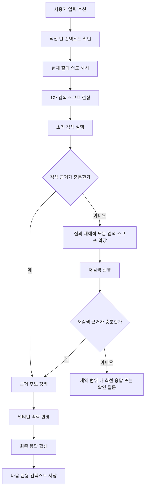
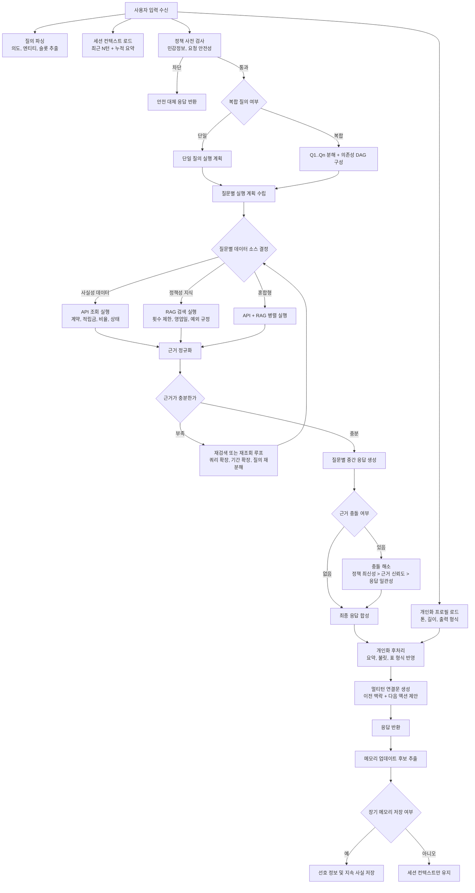

# AIA Multiturn with LLM and RAG

멀티턴 Assistant 설계를 문서와 데모 스크립트로 정리한 저장소입니다. 실행 서버 구현보다는 다음 산출물에 초점을 둡니다.

- 멀티턴 대화 흐름 설계 문서
- OpenAPI 인터페이스 초안
- 프롬프트 노드/파이프라인 정의
- 메모리 저장 정책 가이드
- CSV 샘플 기반 프롬프트 렌더링 데모

## 프로젝트 목표

- 연속 대화 맥락을 유지하는 Assistant 오케스트레이션 정의
- 복합 질문을 분해하고 질문별 실행 전략을 설계
- API 사실 조회와 RAG 규정 조회를 함께 사용하는 응답 구조 정리
- 사용자 선호를 후처리 단계에 반영하는 개인화 흐름 문서화
- 메모리 후보 추출과 저장 정책을 분리해 설계

## End-to-End Flowchart

### Basic Flow



### Advanced Flow



Flow basis:
- Prompt pipeline: `B -> CD -> M0P0 -> G0 -> E -> F1 -> F2F3F4 -> F5F6 -> V0V1 -> S0 -> S1S2 -> T0 -> T1 -> T2 -> R0R1R2R3`
- API surfaces: `/chat`, `/plan`, `/retrieve`, `/rerank`, `/answer`, `/memory/upsert`, `/policy/check`
- Detailed references: [docs/multiturn-dialog-flow-advanced.md](docs/multiturn-dialog-flow-advanced.md), [docs/prompt-config.yaml](docs/prompt-config.yaml), [docs/openapi-multiturn.yaml](docs/openapi-multiturn.yaml)

## 저장소 구성

```text
.
|-- README.md
|-- data/
|   |-- MULTITURN_20260306.csv
|   `-- 개인화질문_답변_유형.xlsx
|-- docs/
|   |-- memory-usage-guide.md
|   |-- multiturn-dialog-flow-advanced.md
|   |-- multiturn-dialog-flow-basic.md
|   |-- multiturn-flow-advanced-prompts.md
|   |-- multiturn-flow-basic-prompts.md
|   |-- multiturn-flow-prompts.md
|   |-- openapi-multiturn.yaml
|   `-- prompt-config.yaml
`-- scripts/
    `-- demo-prompt-test.mjs
```

## 핵심 문서

### 아키텍처 및 흐름

- [docs/multiturn-dialog-flow-basic.md](docs/multiturn-dialog-flow-basic.md)
  - 기본 멀티턴 검색/응답 흐름
- [docs/multiturn-dialog-flow-advanced.md](docs/multiturn-dialog-flow-advanced.md)
  - CSV 분석 내용을 반영한 고급 오케스트레이션
  - 복합 질문 분해, API/RAG 소스 분기, 충돌 해결, 메모리 저장 규칙 포함

### 프롬프트 설계

- [docs/multiturn-flow-basic-prompts.md](docs/multiturn-flow-basic-prompts.md)
- [docs/multiturn-flow-advanced-prompts.md](docs/multiturn-flow-advanced-prompts.md)
- [docs/multiturn-flow-prompts.md](docs/multiturn-flow-prompts.md)
  - 입력 파싱, 복합질문 분해, 검색 전략, 근거 평가, 최종 합성, 메모리 저장 후보 판정까지의 프롬프트 템플릿 정리

### 프롬프트 설정

- [docs/prompt-config.yaml](docs/prompt-config.yaml)
  - 파이프라인에서 사용하는 실제 노드 정의 파일
  - `global_system`, `nodes`, `pipeline`, `demo_context` 포함
  - 확장자는 YAML이지만 현재 내용은 JSON 형식이며 데모 스크립트도 `JSON.parse`로 읽습니다

현재 정의된 대표 노드:

- `B`: 입력 파싱
- `CD`: 복합질문 판정 및 분해
- `M0P0`: 컨텍스트/프로필 정규화
- `G0`: 정책 사전 검사
- `E`: 검색 전략 결정
- `F1`: 쿼리 재작성
- `F2F3F4`: DAG/실행 단계 산출
- `F5F6`: 근거 추출 및 스코어링
- `V0V1`: 근거 충분성 평가와 재검색 액션
- `S0`: 질문별 중간답 생성
- `S1S2`: 충돌 감지 및 해결
- `T0`, `T1`, `T2`: 최종 합성, 개인화, 멀티턴 연결문 생성
- `R0R1R2R3`: 메모리 후보 추출 및 저장 판단

### API 스펙

- [docs/openapi-multiturn.yaml](docs/openapi-multiturn.yaml)
  - 멀티턴 Assistant 인터페이스 초안
  - 주요 엔드포인트:
    - `/chat`
    - `/plan`
    - `/retrieve`
    - `/rerank`
    - `/answer`
    - `/memory/upsert`
    - `/policy/check`

### 메모리 가이드

- [docs/memory-usage-guide.md](docs/memory-usage-guide.md)
  - 장기 메모리와 세션 메모리의 구분
  - 저장 시점, 저장 금지 대상, 정책 기준
  - `/memory/upsert` 요청/응답 예시
  - `/chat`과 메모리 쓰기 옵션의 연동 방식

### 샘플 데이터

- [data/MULTITURN_20260306.csv](data/MULTITURN_20260306.csv)
  - 멀티턴 질문/답변 예시 데이터
- [data/개인화질문_답변_유형.xlsx](data/%EA%B0%9C%EC%9D%B8%ED%99%94%EC%A7%88%EB%AC%B8_%EB%8B%B5%EB%B3%80_%EC%9C%A0%ED%98%95.xlsx)
  - 개인화 질문 유형 참고 데이터

## 데모 스크립트

[scripts/demo-prompt-test.mjs](scripts/demo-prompt-test.mjs)는 프롬프트 설정을 읽어 전체 파이프라인 또는 특정 노드의 프롬프트를 렌더링합니다.

주요 동작:

1. [docs/prompt-config.yaml](docs/prompt-config.yaml) 로드
2. `global_system`, `nodes`, `pipeline`, `demo_context` 파싱
3. 필요 시 CSV 특정 행을 읽어 데모 변수에 주입
4. 템플릿 변수를 치환해 최종 프롬프트와 기대 출력 스키마 출력

전제:

- Node.js 18 이상 권장
- [docs/prompt-config.yaml](docs/prompt-config.yaml)은 JSON 형식을 유지해야 함
- CSV는 UTF-8 기준으로 읽음

실행 예시:

```bash
node scripts/demo-prompt-test.mjs
node scripts/demo-prompt-test.mjs B
node scripts/demo-prompt-test.mjs docs/prompt-config.yaml
node scripts/demo-prompt-test.mjs --csv data/MULTITURN_20260306.csv --row 1
node scripts/demo-prompt-test.mjs B --csv data/MULTITURN_20260306.csv --row 3
```

CSV 연동 시 데모 컨텍스트에 반영되는 대표 값:

- 질문 -> `user_message`, `question`, `questions`
- 답변 예시 -> `answer`, `drafts`, `resolved_drafts`
- `NO.`, `구분` -> `turn_data.csv_no`, `turn_data.csv_category`

## 권장 확인 순서

1. [docs/multiturn-dialog-flow-advanced.md](docs/multiturn-dialog-flow-advanced.md)로 전체 흐름 파악
2. [docs/openapi-multiturn.yaml](docs/openapi-multiturn.yaml)로 모듈 경계와 입출력 확인
3. [docs/prompt-config.yaml](docs/prompt-config.yaml)로 실제 프롬프트 노드 구성 확인
4. [docs/memory-usage-guide.md](docs/memory-usage-guide.md)로 메모리 저장 정책 확인
5. [scripts/demo-prompt-test.mjs](scripts/demo-prompt-test.mjs)로 노드별 프롬프트 렌더링 점검
6. [data/MULTITURN_20260306.csv](data/MULTITURN_20260306.csv)로 샘플 질의 기준 테스트

## 현재 범위와 제약

- 이 저장소는 설계 및 데모 중심이며 실제 서버 구현체는 포함하지 않습니다.
- [docs/openapi-multiturn.yaml](docs/openapi-multiturn.yaml)은 초안이므로 운영 API와 다를 수 있습니다.
- [docs/prompt-config.yaml](docs/prompt-config.yaml)은 파일명과 달리 현재 JSON 파싱 전제를 따릅니다.
- CSV 헤더 인코딩 상태에 따라 일부 컬럼 매핑은 점검이 필요할 수 있습니다.

## 참고 파일

- [docs/multiturn-dialog-flow-advanced.md](docs/multiturn-dialog-flow-advanced.md)
- [docs/memory-usage-guide.md](docs/memory-usage-guide.md)
- [docs/openapi-multiturn.yaml](docs/openapi-multiturn.yaml)
- [docs/prompt-config.yaml](docs/prompt-config.yaml)
- [docs/multiturn-flow-prompts.md](docs/multiturn-flow-prompts.md)
- [scripts/demo-prompt-test.mjs](scripts/demo-prompt-test.mjs)
- [data/MULTITURN_20260306.csv](data/MULTITURN_20260306.csv)
