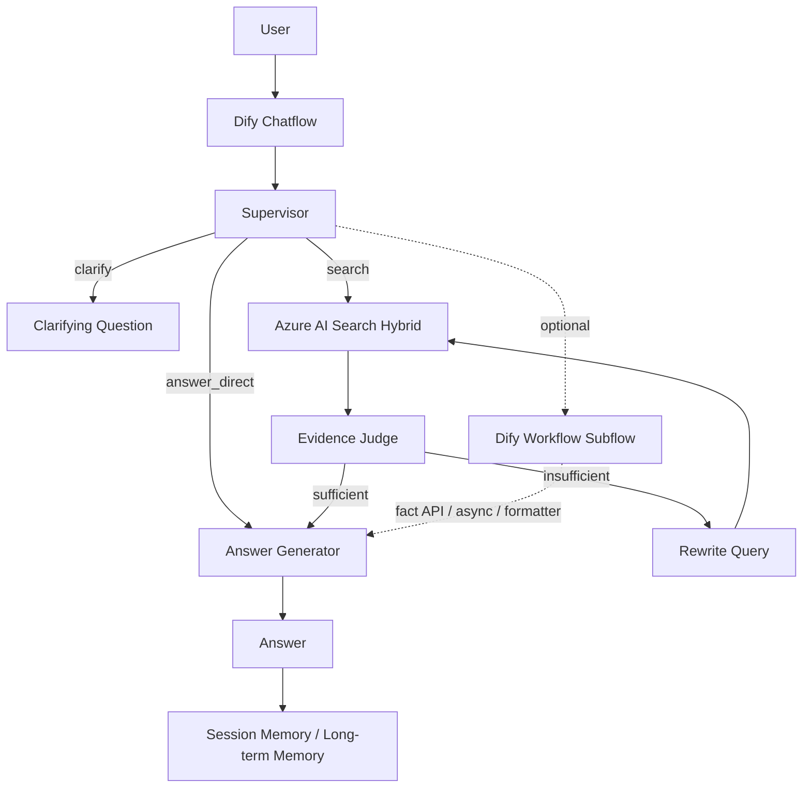

# AIA Multiturn with LLM and RAG

이 저장소는 멀티턴 상담형 Assistant를 `Dify Chatflow + Azure AI Search hybrid search + Workflow subflow` 구조로 설계하기 위한 문서 중심 저장소입니다.

실행 서버 구현보다 다음 산출물에 초점을 둡니다.

- 멀티턴 대화 흐름 설계 문서
- OpenAPI 인터페이스 초안
- 프롬프트 노드/파이프라인 정의
- 메모리 저장 정책 가이드
- 조사 결과 요약 메모와 아키텍처 메모
- CSV 기반 프롬프트 테스트용 데모 스크립트

## 현재 권장 아키텍처

- 메인 오케스트레이션: `Dify Chatflow`
- 검색 계층: `Azure AI Search hybrid search`
- 검색 품질: `BM25 + vector + RRF + optional semantic ranker`
- 보조 실행 경로: `Dify Workflow`
- 메모리 주체: `Chatflow`
- 답변 체인: `Supervisor -> Search Tool -> Evidence Judge -> Answer Generator`

## End-to-End Flow


```mermaid
flowchart TD
    U[User] --> C[Dify Chatflow]
    C --> S[Supervisor]
    S -->|answer_direct| A[Answer Generator]
    S -->|clarify| Q[Clarifying Question]
    S -->|search| H[Azure AI Search Hybrid]
    H --> J[Evidence Judge]
    J -->|sufficient| A
    J -->|insufficient| R[Rewrite Query]
    R --> H
    A --> O[Answer]
    O --> M[Session Memory / Long-term Memory]
    S -. optional .-> W[Dify Workflow Subflow]
    W -. fact API / async / formatter .-> A
```

핵심 원칙:

- 멀티턴 상태와 메모리는 `Chatflow`가 관리한다.
- `Workflow`는 무상태 서브플로로 사용한다.
- 검색/리랭킹은 가능하면 `Azure AI Search` 계층에서 처리한다.
- 근거가 부족하면 `Judge -> rewrite -> retry` 루프로 보완한다.

## 문서 구성

```text
.
|-- README.md
|-- data/
|   |-- MULTITURN_20260306.csv
|   `-- 개인화질문_답변_유형.xlsx
|-- docs/
|   |-- deep-research-report.md
|   |-- deep-research-architecture-memo.md
|   |-- memory-usage-guide.md
|   |-- multiturn-dialog-flow-advanced.md
|   |-- multiturn-dialog-flow-basic.md
|   |-- multiturn-flow-advanced-prompts.md
|   |-- multiturn-flow-basic-prompts.md
|   |-- multiturn-flow-prompts.md
|   |-- openapi-multiturn.yaml
|   `-- prompt-config.yaml
`-- scripts/
    `-- demo-prompt-test.mjs
```

## 핵심 문서

### 아키텍처 메모

- [docs/deep-research-architecture-memo.md](docs/deep-research-architecture-memo.md)
  - `Azure AI Search`와 `Dify` 관련 핵심만 1페이지로 정리한 메모
  - 권장 아키텍처, 노드 체인, 역할 분리, Mermaid 다이어그램 포함

- [docs/deep-research-report.md](docs/deep-research-report.md)
  - 조사 원문 보고서
  - `AI Search`, `Dify Chatflow/Workflow`, `LangGraph`, 운영 관점 내용을 포함

### 대화 흐름 문서

- [docs/multiturn-dialog-flow-basic.md](docs/multiturn-dialog-flow-basic.md)
  - 기본 멀티턴 검색/응답 흐름

- [docs/multiturn-dialog-flow-advanced.md](docs/multiturn-dialog-flow-advanced.md)
  - 현재 권장 고급 흐름
  - `Chatflow` 중심 멀티턴
  - `Azure AI Search hybrid + semantic ranker`
  - `answer_direct | search | clarify` 라우팅
  - `Judge -> rewrite -> retry` 루프
  - `Workflow/API + AI Search` 병행 패턴

### 프롬프트/파이프라인 문서

- [docs/multiturn-flow-prompts.md](docs/multiturn-flow-prompts.md)
  - 현재 권장 프롬프트 체인
  - `SUP`, `WF`, `SRCH`, `JUDGE`, `REWRITE`, `ANS`, `MEM` 단계 포함

- [docs/multiturn-flow-basic-prompts.md](docs/multiturn-flow-basic-prompts.md)
  - 기본 흐름 프롬프트 템플릿

- [docs/multiturn-flow-advanced-prompts.md](docs/multiturn-flow-advanced-prompts.md)
  - 고급 흐름 프롬프트 템플릿

- [docs/prompt-config.yaml](docs/prompt-config.yaml)
  - 실제 데모 스크립트가 읽는 프롬프트 설정 파일
  - 현재는 YAML 확장자를 사용하지만 내용은 JSON 형식

현재 주요 노드:

- `B`: 입력 파싱
- `POL`: 정책 사전 검사
- `SUP`: Supervisor 라우팅 + 질의 재작성
- `WF`: Workflow 호출 판정
- `SRCH`: Azure AI Search 호출 파라미터 생성
- `NORM`: 검색 결과 정규화
- `JUDGE`: 근거 충분성 판정
- `REWRITE`: 재검색용 질의 재작성
- `ANS`: 최종 답변 생성
- `T1`, `T2`: 개인화 후처리, 멀티턴 연결문 생성
- `MEM`: 메모리 후보 추출 및 저장 판단

### API 스펙

- [docs/openapi-multiturn.yaml](docs/openapi-multiturn.yaml)
  - 현재 아키텍처 기준 OpenAPI 초안

주요 엔드포인트:

- `/chat`
- `/supervisor/route`
- `/search/hybrid`
- `/judge/evidence`
- `/workflow/dispatch`
- `/answer`
- `/memory/upsert`
- `/policy/check`

### 메모리 가이드

- [docs/memory-usage-guide.md](docs/memory-usage-guide.md)
  - `Chatflow`와 `Workflow`의 메모리 책임 분리
  - `session_memory`, `long_term_memory` 저장 규칙
  - `/memory/upsert` 요청/응답 예시
  - `Workflow` 결과를 메모리에 반영하는 기준

### 샘플 데이터

- [data/MULTITURN_20260306.csv](data/MULTITURN_20260306.csv)
  - 멀티턴 질문/답변 예시 데이터

- [data/개인화질문_답변_유형.xlsx](data/%EA%B0%9C%EC%9D%B8%ED%99%94%EC%A7%88%EB%AC%B8_%EB%8B%B5%EB%B3%80_%EC%9C%A0%ED%98%95.xlsx)
  - 개인화 질문 유형 참고 데이터

## 데모 스크립트

[scripts/demo-prompt-test.mjs](scripts/demo-prompt-test.mjs)는 [docs/prompt-config.yaml](docs/prompt-config.yaml)을 읽어 프롬프트 노드별 렌더링을 확인하는 데모 스크립트입니다.

주요 동작:

1. `prompt-config.yaml` 로드
2. `global_system`, `nodes`, `pipeline`, `demo_context` 파싱
3. 필요 시 CSV 특정 행을 읽어 데모 변수에 주입
4. 최종 프롬프트와 출력 스키마 출력

실행 예시:

```bash
node scripts/demo-prompt-test.mjs
node scripts/demo-prompt-test.mjs B
node scripts/demo-prompt-test.mjs docs/prompt-config.yaml
node scripts/demo-prompt-test.mjs --csv data/MULTITURN_20260306.csv --row 1
node scripts/demo-prompt-test.mjs B --csv data/MULTITURN_20260306.csv --row 3
```

전제:

- Node.js 18 이상 권장
- `docs/prompt-config.yaml`은 현재 JSON 형식이어야 함
- CSV는 UTF-8 기준으로 읽는 것을 전제

## 권장 확인 순서

1. [docs/deep-research-architecture-memo.md](docs/deep-research-architecture-memo.md)로 전체 방향 확인
2. [docs/multiturn-dialog-flow-advanced.md](docs/multiturn-dialog-flow-advanced.md)로 런타임 흐름 확인
3. [docs/openapi-multiturn.yaml](docs/openapi-multiturn.yaml)로 모듈 경계와 입출력 확인
4. [docs/prompt-config.yaml](docs/prompt-config.yaml)로 실제 프롬프트 노드 구성 확인
5. [docs/memory-usage-guide.md](docs/memory-usage-guide.md)로 메모리 저장 정책 확인
6. [scripts/demo-prompt-test.mjs](scripts/demo-prompt-test.mjs)로 노드별 렌더링 점검
7. [data/MULTITURN_20260306.csv](data/MULTITURN_20260306.csv)로 샘플 질의 테스트

## 현재 범위와 제약

- 이 저장소는 구현 코드보다 설계 문서와 인터페이스 정의 중심이다.
- [docs/openapi-multiturn.yaml](docs/openapi-multiturn.yaml)은 초안이므로 실제 운영 API와 다를 수 있다.
- [docs/prompt-config.yaml](docs/prompt-config.yaml)은 파일명과 달리 현재 JSON 형식을 전제로 한다.
- `Dify Workflow` 관련 내용은 메모리 없는 보조 서브플로 사용을 전제로 정리되어 있다.
- CSV 로더 인코딩 상태에 따라 일부 컬럼 매핑 조정이 필요할 수 있다.

## 참고 파일

- [docs/deep-research-architecture-memo.md](docs/deep-research-architecture-memo.md)
- [docs/deep-research-report.md](docs/deep-research-report.md)
- [docs/multiturn-dialog-flow-advanced.md](docs/multiturn-dialog-flow-advanced.md)
- [docs/memory-usage-guide.md](docs/memory-usage-guide.md)
- [docs/openapi-multiturn.yaml](docs/openapi-multiturn.yaml)
- [docs/prompt-config.yaml](docs/prompt-config.yaml)
- [docs/multiturn-flow-prompts.md](docs/multiturn-flow-prompts.md)
- [scripts/demo-prompt-test.mjs](scripts/demo-prompt-test.mjs)
- [data/MULTITURN_20260306.csv](data/MULTITURN_20260306.csv)
