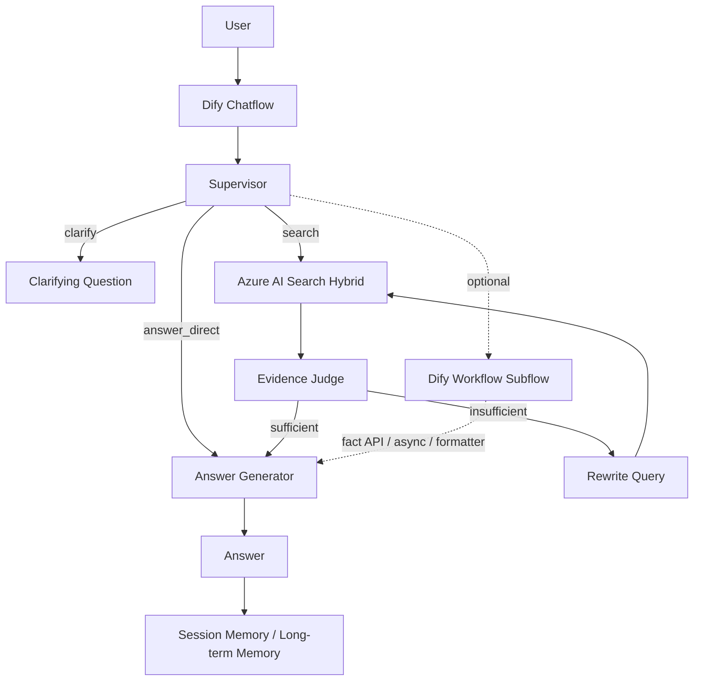

# Deep Research Architecture Memo

작성일: 2026-03-19  
기준 문서: [deep-research-report.md](deep-research-report.md)

## 목적
`deep-research-report.md`의 내용 중 `Azure AI Search`와 `Dify` 관련 핵심만 추려, 멀티턴 상담형 Assistant 설계에 바로 쓰기 위한 1페이지 메모로 정리한다.

## 아키텍처 다이어그램

## 권장 아키텍처 결론
- 멀티턴 상담형 메인 오케스트레이션은 `Dify Chatflow`를 사용한다.
- 검색 계층의 기본값은 `Azure AI Search hybrid search`로 둔다.
- 검색 품질 기본 조합은 `BM25 + vector + RRF + optional semantic ranker`다.
- 답변 흐름은 `Supervisor -> Search Tool -> Evidence Judge -> Answer Generator` 체인으로 설계한다.
- `Dify Workflow`는 메모리 없는 보조 실행 경로로만 사용한다.

## 왜 이렇게 가는가

### 1. Dify 선택 기준
- `Chatflow`는 대화 메모리를 포함하므로 멀티턴 상담형 흐름에 적합하다.
- `Workflow`는 배치, 자동화, 단발성 작업에는 적합하지만 멀티턴 메모리 주체로 쓰기에는 제한이 있다.
- 따라서 메인 대화 상태는 `Chatflow`가 유지하고, `Workflow`는 외부 API 조회나 후처리 서브플로로 제한하는 것이 자연스럽다.

### 2. AI Search 선택 기준
- `Azure AI Search hybrid search`는 키워드 검색과 벡터 검색을 함께 사용해 복합 질문과 멀티턴 질의에서 안정적이다.
- 결과 통합은 `RRF`가 처리하고, 필요 시 `semantic ranker`가 상위 후보를 다시 재정렬한다.
- 이 구조를 검색 계층에서 처리하면 애플리케이션 레벨 리랭킹 복잡도를 줄일 수 있다.

## 권장 실행 흐름
1. 사용자가 질문을 입력한다.
2. `Chatflow Supervisor`가 세션 메모리를 읽고 현재 턴을 해석한다.
3. Supervisor가 질문을 `answer_direct | search | clarify`로 라우팅한다.
4. 검색이 필요하면 `Azure AI Search Hybrid Tool`을 호출한다.
5. `Evidence Judge`가 현재 검색 결과가 충분한지 판정한다.
6. 충분하면 `Answer Generator`가 근거 기반 답변을 생성한다.
7. 부족하면 Supervisor가 질의를 재작성해 제한된 횟수 안에서 재검색한다.
8. 응답 후 세션 메모리와 장기 메모리 후보를 분리 저장한다.

## 권장 노드 체인
- `Start`
- `Supervisor`
- `Azure AI Search Hybrid Tool`
- `Evidence Judge`
- `Answer Generator`
- `Answer`

## 컴포넌트 역할 분리
- `Chatflow`
  - 메인 대화 진입점
  - 멀티턴 메모리 유지
  - Supervisor/Answer 생성 연결
- `Workflow`
  - 외부 API 조회
  - 비동기 작업
  - 포맷 변환/후처리
- `Azure AI Search`
  - 하이브리드 검색
  - 메타데이터 필터 적용
  - semantic ranker 기반 상위 결과 재정렬
- `Evidence Judge`
  - 답변 가능 여부 판단
  - 부족 근거와 재검색 방향 제시

## 설계 원칙
- 멀티턴 메모리의 주체는 `Chatflow`다.
- 검색/리랭킹의 주체는 `Azure AI Search`다.
- `Workflow`는 상태 저장형 오케스트레이터가 아니라 보조 서브플로다.
- 근거가 부족할 때는 추측 대신 `재검색` 또는 `추가 확인 질문`으로 전환한다.

## 구현 메모
- 검색 툴 입력 최소 필드: `query`, `top_k`, `use_semantic_ranker`, `filters`
- Supervisor 출력 최소 필드: `route`, `rewritten_query`, `sub_questions`, `filters`, `clarifying_question`
- Judge 출력 최소 필드: `verdict`, `missing`, `suggested_rewrite`

## 최종 권고
- 멀티턴 상담형 Assistant라면 `Dify Chatflow + Azure AI Search hybrid + Judge loop`를 기본 아키텍처로 채택한다.
- `Dify Workflow`는 메인 플로우를 대체하지 말고, 외부 연동과 자동화 처리에만 한정해 사용한다.

