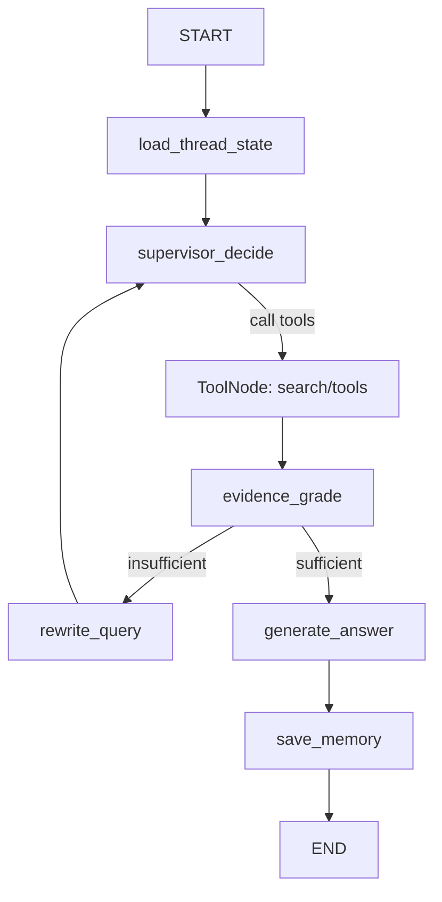

# Azure 기반 Agentic RAG 아키텍처 심층 리서치

## Executive summary

Agentic RAG는 “검색→생성” 1회로 끝나는 단순 RAG와 달리, **Supervisor(오케스트레이터)** 가 대화 맥락을 유지하면서 질의 정제/분해, 하이브리드 검색, 리랭킹, 근거 충분성(evidence sufficiency) 판단, 필요 시 재검색/재작성 루프를 수행한 뒤 답변을 확정하는 구조가 핵심입니다. citeturn7view0turn6search0turn6search1

Azure에서 이를 GPU 추론까지 포함해 운영할 때 큰 축은 두 가지입니다.  
- **AKS(컨테이너 기반)**: (1) CPU 마이크로서비스와 (2) GPU 추론 워크로드를 **노드풀로 분리**하고, **Cluster Autoscaler/HPA/KEDA**를 조합해 탄력적으로 확장하는 방식이 정석에 가깝습니다. 특히 AKS의 Cluster Autoscaler는 *스케줄 불가(pending) 파드*를 관찰해 노드를 늘리고, HPA/VPA는 파드 레벨 확장을 담당합니다. citeturn10view0turn20view0  
- **VMSS(가상머신 기반)**: 단일(또는 소수) GPU 모델 서버를 “VM 어플라이언스”처럼 운영하거나, 컨테이너 오케스트레이션 복잡도를 줄이고 싶을 때 유리합니다. VMSS Autoscale은 **일정/메트릭 임계치/예측 AI 기반**으로 인스턴스 수를 자동 조정할 수 있고, 부하분산기·상태 프로브와 결합됩니다. citeturn23view0turn17view0turn24view0

검색 계층은 **Azure AI Search 하이브리드 검색(키워드+벡터)** + (선택) **semantic ranker(의미 기반 재정렬)** 조합이 “복합 질문/멀티턴”에서 특히 강합니다. 하이브리드는 `search`(BM25)와 `vectors`(벡터)를 병렬 실행하고 RRF로 합쳐 단일 랭킹을 만든 뒤, semantic ranker가 상위 후보를 재정렬하는 형태로 설명됩니다. citeturn13search8turn13search2turn13search27

AIA(콜센터/보험 도메인) 관점의 실무 권고를 요약하면 다음과 같습니다(아래는 문서 근거를 바탕으로 한 설계적 결론/추론 포함).  
- **멀티턴·다중 모델·잦은 변경(프롬프트/툴/룰)** 이 전제라면: **AKS**가 운영 유연성(마이크로서비스/서브에이전트/관측성 파이프라인)에서 우세합니다. citeturn10view0turn20view0turn26view0  
- **단일 대형 모델 중심(모델 서버가 핵심)**, “VM 기반 운영 표준”이 강하고 배포 단순성이 중요하면: **VMSS**도 충분히 경쟁력 있습니다(자동 복구/오케스트레이션 모드/Autoscale). citeturn27search1turn23view0turn27search11  
- Dify를 멀티턴 상담형으로 쓰려면 **Chatflow(메모리 포함)** 가 기본 선택이며, Workflow는 배치/자동화에 적합하고 메모리 기능이 제한됩니다. citeturn25view0turn12search2  
- LangGraph는 체크포인터 기반 **지속성(threads/checkpoints)** 과 **실패 지점 재시작(내구 실행)** 을 “프레임워크 레벨 기능”으로 제공하므로, Agentic RAG의 재시도/사람 개입/디버깅(time travel)에 강합니다. citeturn26view0turn26view2

---

## AKS 기반 Agentic RAG GPU 아키텍처

아래는 “대화형 Agentic RAG + GPU 추론”을 AKS에 배치할 때의 **런타임 흐름(Flowchart)** 입니다. (Ingress, Supervisor, rewrite/decompose, hybrid search, rerank, evidence check, answer gen, memory, tool calls, queue, monitoring, autoscaling, zone redundancy, security 요소를 모두 포함)

```mermaid
flowchart TB
  U[User / 상담채널] --> EDGE

  subgraph EDGE[Edge & Ingress]
    AFD[Azure Front Door (optional)]
    AGC[L7 Ingress: Application Gateway for Containers\nor AKS App Routing Add-on]
  end

  EDGE --> APIGW

  subgraph AKS[AKS Cluster (Multi Node Pools)]
    subgraph CPU[CPU Node Pool(s)]
      APIGW[RAG API Gateway / AuthN-Z]
      SUP[Supervisor (Orchestrator)]
      MEM[Conversation Memory Manager]
      TOOL[Tool Router / Policy Guard]
      Q[Queue (Service Bus)\nasync jobs: long tools, batch retrieval, eval]
    end

    subgraph GPU[GPU Node Pool(s)]
      LLM1[LLM: Query Rewrite / Decompose\n(small/fast)]
      LLM2[LLM: Answer Generator\n(large)]
      JUDGE[LLM: Evidence Sufficiency Judge\n(optional)]
    end
  end

  subgraph SEARCH[Retrieval & Data]
    AIS[Azure AI Search\nHybrid: BM25 + Vector (RRF)\n+ optional Semantic Ranker]
    KB[Dify Knowledge Base or Doc Store\n(optional)]
    KV[Key Vault (certs/secrets)]
    REDIS[Cache (optional)]
  end

  subgraph OBS[Observability & Ops]
    AMP[Azure Monitor Managed Prometheus]
    AMG[Azure Managed Grafana]
    LOG[Logs/Traces (App Insights/OpenTelemetry)]
    SCALE[Autoscale\nCluster Autoscaler + HPA/KEDA]
    ZONE[Zone redundancy\nmulti-zone node pools + zone-redundant ingress]
  end

  APIGW --> SUP
  SUP --> MEM
  SUP --> LLM1
  LLM1 --> SUP

  SUP -->|decompose| SUP
  SUP -->|tool call: hybrid search| AIS
  AIS --> SUP

  SUP -->|optional rerank| AIS
  SUP -->|optional judge| JUDGE
  JUDGE --> SUP

  SUP -->|generate answer| LLM2
  LLM2 --> SUP

  SUP -->|tool calls| TOOL
  TOOL --> Q
  Q --> TOOL
  SUP --> MEM
  SUP --> APIGW --> U

  AKS --> OBS
  SEARCH --> OBS
  KV --> AGC
```

AKS Ingress는 L4 LoadBalancer 서비스만으로도 트래픽 분산이 되지만, L4는 애플리케이션을 인식하지 못해 경로 기반 라우팅 같은 L7 규칙을 제공하지 못합니다. AKS 문서는 수신 컨트롤러(L7)와 LoadBalancer 타입(L4)의 차이를 명시하고, 장기 표준으로 Gateway API로의 이동과 컨테이너용 Application Gateway 같은 옵션을 비교합니다. citeturn8view0

GPU 쪽은 “GPU 노드풀 + 스케줄링 + 텔레메트리”가 운영 난이도의 핵심인데, AKS는 NVIDIA GPU 노드풀을 구성할 때 노드 테인트/오토스케일러 같은 패턴을 포함한 예시를 제공합니다. 또한 (미리 보기이긴 하지만) **완전 관리형 GPU 노드풀**은 GPU 드라이버, 디바이스 플러그인, DCGM 메트릭 내보내기 설치를 기본 제공해 운영 오버헤드를 줄이는 방향을 제시합니다. (단, 문서에 명시된 대로 프리뷰는 SLA 제외이므로 프로덕션 적용은 정책 검토가 필요합니다.) citeturn22view0turn21view0

오토스케일은 “노드 확장”과 “파드(모델 서버) 확장”을 분리해 설계하는 것이 일반적입니다. AKS의 Cluster Autoscaler는 리소스 제약으로 스케줄되지 못하는 파드를 감지해 노드를 늘리고, HPA/VPA는 파드 확장을 담당합니다. 가용성 영역을 쓰는 경우 Cluster Autoscaler는 존 인지적(zone-aware)이 아니며, 문서는 **존당 단일 노드풀**과 `--balance-similar-node-groups` 같은 분산 균형 베스트 프랙티스를 권고합니다. citeturn10view0

GPU 부하 기반 파드 오토스케일은 기본 Kubernetes 메트릭(CPU/메모리)만으로는 부족한 경우가 많아, **DCGM 메트릭 + Managed Prometheus + KEDA** 조합이 실무적으로 자주 채택됩니다. Microsoft 문서는 DCGM exporter 메트릭을 Managed Prometheus로 수집하고 KEDA가 이를 소비해 GPU 워크로드를 자동 확장하는 절차를 설명하며, 예시로 `DCGM_FI_DEV_GPU_UTIL` 기반 스케일러를 제공합니다. citeturn20view0turn1search7turn1search3

관측성은 AKS/컨테이너 관점에서 GPU 메트릭 수집 경로가 비교적 잘 정리돼 있습니다. Container insights는 GPU 클러스터 모니터링을 지원하고(단, 수집 방식 중 일부는 “더 이상 권장되지 않음” 경고가 있으므로 Managed Prometheus 경로를 우선 고려), DCGM exporter 메트릭을 Azure Monitor managed service for Prometheus에 저장한 뒤 Grafana로 조회할 수 있습니다. citeturn1search3turn1search7turn1search22

보안 측면에서는 (1) 인그레스 TLS 인증서/비밀은 Key Vault 연동을 사용하고, (2) 네트워크 단에서는 기본적으로 인바운드를 닫는 Standard Load Balancer/NSG 정책을 전제로 설계하는 흐름이 Microsoft 문서에 명시돼 있습니다. AKS app routing add-on은 Azure DNS·Key Vault 인증서 연동을 통해 TLS 구성을 설명합니다. citeturn17view0turn18search3turn8view0

---

## VMSS 기반 Agentic RAG GPU 아키텍처

VMSS 기반은 “GPU VM(모델 서버) + L4/L7 진입부 + (필요 시) 별도 CPU 오케스트레이터”로 구성하는 경우가 많습니다. 아래는 VMSS로 GPU 추론을 배치했을 때의 대표 흐름입니다.

```mermaid
flowchart TB
  U[User / 상담채널] --> EDGE

  subgraph EDGE[Edge & Ingress]
    AFD[Azure Front Door (optional)]
    AGW[L7: Application Gateway (optional)]
    ALB[L4: Standard Load Balancer]
  end

  EDGE --> ORCH

  subgraph ORCH[CPU Orchestration Tier]
    API[RAG API Gateway]
    SUP[Supervisor (Orchestrator)]
    MEM[Conversation Memory Store\n(Redis/DB)]
    Q[Queue (Service Bus)\nasync tasks]
  end

  subgraph VMSS[GPU Inference Tier (VMSS)]
    GWL[GPU Model Server Instances\n(Uniform or Flexible VMSS)]
    PROBE[Health Probe]
    AUTO[VMSS Autoscale + Auto Repairs]
  end

  subgraph SEARCH[Retrieval & Data]
    AIS[Azure AI Search Hybrid + Semantic Ranker]
    KV[Key Vault]
    LOG[Azure Monitor / Logs]
  end

  API --> SUP --> AIS --> SUP --> API --> U
  SUP -->|tool calls| Q
  Q --> SUP

  ALB --> GWL
  PROBE --> ALB
  AUTO --> VMSS
  LOG --> VMSS
  KV --> AGW
```

VMSS Autoscale은 인스턴스 수를 **수동/스케줄/메트릭 임계치/예측 AI** 로 증감할 수 있으며, 호스트 기반 메트릭 외에도 진단 확장, Application Insights, 심지어 Service Bus 큐 같은 원본 메트릭을 스케일 트리거로 사용할 수 있다고 문서에 정리돼 있습니다. citeturn23view0

VMSS의 내결함성은 “다중 가용성 영역 및 장애 도메인 분산”이 핵심이며, Microsoft의 VMSS 안정성 문서는 영역 스패닝(scale set을 여러 존에 분산) 구성의 이점과, 단일 존 고정은 요구조건 검토 후에만 권장된다고 설명합니다. 또한 부하 분산(Load Balancer/Application Gateway)과의 통합을 언급하며, 전체 솔루션 관점에서 네트워크/스토리지/애플리케이션까지 함께 복원력을 맞춰야 한다고 강조합니다. citeturn9view0turn27search0

VMSS는 인스턴스 “자체 치유”를 위해 **Automatic instance repairs** 기능을 제공합니다. 문서 기준으로 Application Health 확장 또는 Load Balancer 상태 프로브가 비정상 인스턴스를 감지하면, 삭제/교체, 재이미징, 재시작 같은 복구 작업을 트리거할 수 있습니다. citeturn27search3turn27search1

진입부에서 Standard Load Balancer는 계층 4에서 동작하며, 구성된 부하분산 규칙과 상태 프로브에 의해 백엔드 VM/VMSS로 트래픽을 분산합니다. 또한 zone-redundant 프런트엔드 구성이 가능하며, 영역 장애 시 플랫폼이 자동으로 감지·응답한다는 안정성 문서가 존재합니다. citeturn17view0turn24view0

VMSS 기반의 약점은 “멀티 모델/멀티 서비스 오케스트레이션”을 VM/네트워크 레벨에서 직접 관리해야 하는 지점에서 운영 복잡도가 다시 올라갈 수 있다는 점입니다(예: 모델별 포트/엔드포인트 분리, 롤링 업그레이드, 캐나리, 모델 라우팅 정책 등). 이 부분은 AKS가 더 자연스럽게 제공하는 영역이며, 반대로 VMSS는 **단일(또는 소수) 모델 서버를 안정적으로 확장/복구**시키는 방향에서 강점이 큽니다. citeturn27search11turn27search3turn23view0

---

## AKS vs VMSS 비교와 선택 가이드

아래 비교는 Azure 공식 문서의 “오토스케일/내결함/수신(L4/L7)/GPU 메트릭 수집 경로”와, Dify/LangGraph의 “멀티턴·지속성·툴 호출” 특성을 종합한 것입니다. citeturn10view0turn23view0turn24view0turn1search7turn25view0turn26view0

| 비교 차원 | AKS (GPU node pool) | VMSS (GPU VM scale set) |
|---|---|---|
| 확장 메커니즘(노드/인스턴스) | Cluster Autoscaler가 스케줄 불가 파드를 기반으로 노드를 증감, 파드 레벨은 HPA/VPA/KEDA로 분리 운영 citeturn10view0turn20view0 | Autoscale 규칙(일정/임계치/예측 AI)로 VM 인스턴스 수 조정 citeturn23view0 |
| GPU 기반 오토스케일 트리거 | DCGM → Managed Prometheus → KEDA(HPA 연동) 경로가 문서화돼 있음 citeturn20view0turn1search7 | 기본은 CPU/메모리 중심. GPU 메트릭을 스케일 트리거로 쓰려면 별도 수집·연계 설계가 필요(조직별 구현 편차 큼). Autoscale의 메트릭 원본 확장 옵션 자체는 제공 citeturn23view0 |
| 추론 지연/성능 튜닝 | 컨테이너 레벨 튜닝, 노드풀 분리, 워크로드별 스케줄링(테인트/리소스 제한) 등 Kubernetes 방식 citeturn22view0turn20view0 | VM 단위 튜닝이 직관적(드라이버/런타임/NUMA 등). 단, 배포·업그레이드 자동화는 별도 설계 필요 citeturn27search11turn27search3 |
| 운영 복잡도 | 초기 학습 비용은 높지만, 마이크로서비스/멀티모델/관측성/배포 자동화로 갈수록 “플랫폼 이점”이 커짐 citeturn10view0turn26view0 | 컨테이너 플랫폼을 덜 쓰면 단순해질 수 있으나, 서비스가 늘수록 VM 운영 자동화 부담이 커질 수 있음 citeturn23view0turn27search3 |
| 비용 최적화 | GPU 노드풀의 min=0 (가능 범위 내) + KEDA로 파드 확장/축소 조합이 비용 최적화에 유리(워크로드 특성 따라 달라짐) citeturn20view0turn22view0 | VMSS 스케일 인/아웃으로 비용 최적화 가능. 예측/스케줄 스케일을 기본 제공 citeturn23view0 |
| GPU-aware routing(“GPU 상태 기반 라우팅”) | L4/L7 인프라만으로 “GPU 사용률”을 직접 라우팅 기준으로 삼기는 어렵고, 앱/모델 서버 계층에서 큐잉/스케줄링 전략이 중요. AKS는 L7 인그레스/게이트웨이로 정책 구현이 수월 citeturn8view0turn17view0 | L4 LB는 애플리케이션 비인식. GPU-aware 라우팅은 보통 애플리케이션 계층에서 구현. VMSS는 네트워크는 단순하지만 라우팅 로직은 별도 citeturn17view0turn24view0 |
| 존(Zone) 복원력 | Cluster Autoscaler는 존 인지적이지 않으므로 존당 노드풀 분리 등을 권고. Ingress/게이트웨이는 zone resilient 옵션을 문서로 제공 citeturn10view0turn8view0 | VMSS는 다중 존 분산을 직접 지원. 단일 존 고정은 지연 요구를 확인한 뒤에만 권장 citeturn9view0turn27search0 |
| 멀티모델(여러 LLM/리랭커/검증기) 적합성 | 모델별 GPU node pool 또는 네임스페이스 분리 등 “컴포넌트화”에 유리. Supervisor/툴/검색도 마이크로서비스로 확장 용이 citeturn10view0turn20view0 | 단일/소수 모델 서버에 유리. 모델이 늘수록 엔드포인트/배포 조합이 복잡해질 수 있음(구현에 따라 상이) citeturn23view0turn27search11 |

AIA 상담/업무 자동화 관점(복합질문·멀티턴·권한/도메인 분기·감사/추적 요구)을 전제로 하면, **Supervisor 중심의 Agentic RAG**가 호출하는 컴포넌트가 늘어나는 경향이 있어 AKS가 구조적으로 유리한 경우가 많습니다. 반면 “GPU 추론만 독립적으로 안정 운영”이 목표이고 오케스트레이션을 상대적으로 단순화할 수 있다면 VMSS가 빠른 해법이 될 수 있습니다. citeturn6search1turn26view0turn23view0

---

## Dify 노드 설계 맵과 JSON/YAML 정의

### 노드 레벨 설계 맵(Agentic RAG를 Dify로 구성)

Dify는 노드 기반 오케스트레이션과 툴 통합을 제공하며, 도구(툴) 노드는 OpenAPI 기반 커스텀 툴을 포함해 여러 타입을 지원하고, 재시도/에러 핸들링 설정(최대 10회 재시도, 최대 5000ms 간격)을 제공합니다. citeturn2search3turn12search3turn12search14

멀티턴 상담 흐름이라면 **Chatflow**를 기본으로 잡는 것이 자연스럽습니다. Chatflow는 “대화 메모리”를 제공하며 LLM 노드 등에서 활성화할 수 있지만, Workflow는 메모리 관련 구성이 없다고 문서에 명시돼 있습니다. citeturn25view0

아래는 Agentic RAG를 Dify Chatflow로 구현할 때의 “권장 노드 체인”입니다(하이브리드 검색은 Azure AI Search를 툴로 호출하는 방식).

- Start(입력: `sys.query`, `sys.conversation_id`, `sys.user_id`)  
- LLM: **Supervisor** (멀티턴 메모리 ON)  
  - 역할: 질의 정제(대화 맥락 반영), 도메인/태스크 분류, 복합질문 분해 여부 결정, 툴 호출 계획 수립  
- Tools 또는 HTTP Request: **Hybrid Search Tool (Azure AI Search)**  
  - 역할: `search + vectors` 하이브리드 요청, 필터(고객/상품/권한) 적용  
- LLM: **Evidence Sufficiency Judge**  
  - 역할: 근거가 충분한지(“지식 기반에 답이 있는지”) 판정 후, 부족 시 재질문/재검색 루프로 분기  
  - Dify 튜토리얼에서도 “Context를 보고 충분하면 답, 부족하면 ‘Information not found…’” 같은 Judge 패턴을 제시합니다. citeturn12search25turn7view0
- LLM: **Answer Generator**  
  - 역할: 근거 기반 답변 생성, 출처/근거 요약 포함  
- Answer: 사용자에게 스트리밍 출력

### Dify용 Mermaid 노드 그래프

```mermaid
flowchart LR
  S[Start\nsys.query, sys.conversation_id] --> SUP[LLM: Supervisor\n(memory ON)]
  SUP -->|tool call| SRCH[Tools/HTTP: Azure AI Search Hybrid]
  SRCH --> J[LLM: Evidence Judge]
  J -->|sufficient| A[LLM: Answer Generator]
  J -->|insufficient -> rewrite| SUP
  A --> OUT[Answer (stream)]
```

이 설계에서 “Hybrid 검색/리랭킹”은 Azure AI Search에서 수행하는 편이 구현 단순성과 운영 측면에서 유리합니다. 하이브리드 검색은 RRF로 결과를 통합하고, semantic ranker는 상위 결과를 재정렬하며, BM25 또는 RRF 결과를 입력으로 의미 기반 리랭킹을 수행한다고 문서가 설명합니다. citeturn13search8turn13search2turn13search27

### 샘플 프롬프트(복사-붙여넣기 템플릿)

**Supervisor (LLM 노드 System Prompt 예시)**  
- 목적: 멀티턴 맥락 반영 질의 재작성 + 분해 계획 + 툴 호출 결정

```text
너는 보험/금융 고객센터용 Supervisor 에이전트다.
목표:
1) 사용자의 현재 질문을 대화 맥락(직전 N턴)과 사용자 프로필(가능한 경우)을 반영해 '검색용 질의'로 재작성한다.
2) 질문이 복합(2개 이상 태스크) 또는 모호하면, (a) 필요한 확인 질문을 최소 1개 생성하거나 (b) 태스크를 분해한다.
3) 검색이 필요하면 Azure AI Search 하이브리드 검색 툴을 호출한다.
4) 검색 결과가 충분하지 않으면 질의를 개선해 재검색한다(최대 2회).

출력은 다음 JSON 스키마를 따른다:
{
  "route": "search" | "clarify" | "answer_direct",
  "rewritten_query": "...",
  "sub_questions": ["..."],
  "filters": {"product":"", "channel":"", "user_tier":""},
  "clarifying_question": "..."
}
```

**Evidence Judge (LLM 노드 System Prompt 예시)**  
Dify 튜토리얼의 Judge 패턴(“Context 기반으로 충분성 판단”)을 상담 도메인에 맞게 확장합니다. citeturn12search25turn7view0

```text
너는 근거 충분성 판정기다.
입력: user_question, context_snippets(검색 결과)
규칙:
- context_snippets 안에 답변에 필요한 핵심 규정/절차/조건이 없으면 "INSUFFICIENT"를 반환하라.
- 충분하면 "SUFFICIENT"를 반환하라.
- 반환 형식:
{"verdict":"SUFFICIENT"|"INSUFFICIENT", "missing":"...", "suggested_rewrite":"..."}
```

### Dify “커스텀 툴” 인터페이스 예시(OpenAPI)

Dify의 커스텀 툴은 OpenAPI/Swagger를 가져와 툴로 사용할 수 있으며, Tools 노드는 구조화된 인터페이스/에러 핸들링/재시도 설정을 제공합니다. citeturn2search3turn12search4

아래는 “Azure AI Search 하이브리드 검색”을 Dify Tool로 등록하기 위한 최소 OpenAPI 예시입니다(예시이므로 실제 엔드포인트/인증은 조직 표준에 맞게 수정).

```yaml
openapi: 3.0.3
info:
  title: azure-ai-search-hybrid-tool
  version: 1.0.0
paths:
  /hybrid_search:
    post:
      operationId: hybrid_search
      summary: Hybrid search (keyword + vector) with optional semantic ranker
      requestBody:
        required: true
        content:
          application/json:
            schema:
              type: object
              required: [query, top_k]
              properties:
                query:
                  type: string
                top_k:
                  type: integer
                  default: 10
                use_semantic_ranker:
                  type: boolean
                  default: true
                filters:
                  type: object
                  additionalProperties: true
      responses:
        "200":
          description: search results
          content:
            application/json:
              schema:
                type: object
                properties:
                  results:
                    type: array
                    items:
                      type: object
                      properties:
                        doc_id: { type: string }
                        title: { type: string }
                        content: { type: string }
                        score: { type: number }
                        reranker_score: { type: number }
```

### Dify DSL “스켈레톤” 예시(YAML)

Dify는 앱을 **DSL(YAML)로 Export/Import**할 수 있으며, 내보내기에는 워크플로 오케스트레이션/노드 설정 등이 포함되고(지식베이스 실제 데이터/서드파티 API 키는 제외) 버전 호환성을 체크한다고 문서에 명시돼 있습니다. citeturn14search0turn14search2

다만 Dify DSL의 “전체 스키마”가 완전하게 문서화돼 있지 않은 구간이 있어(커뮤니티에서도 스펙 문의가 존재), 아래는 **실제 Export 파일 구조(app/workflow/graph/nodes/edges)를 따르는 최소 형태의 ‘가져오기용 스켈레톤’** 입니다. 실제 적용 시에는 Dify Studio에서 한 번 Export한 DSL과 필드/노드 타입을 맞춰 조정하는 것을 전제로 합니다. citeturn14search0turn14search7

```yaml
app:
  name: "Agentic RAG Chatflow (AKS/Azure)"
  mode: advanced-chat
  icon: "🤖"
  version: 0.1.0
workflow:
  graph:
    nodes:
      - id: start
        data:
          type: start
          title: "Start"
      - id: supervisor
        data:
          type: llm
          title: "Supervisor"
          # memory: Chatflow에서 활성화(콘솔 설정에 따라 필드 상이)
      - id: search_tool
        data:
          type: tools
          title: "Azure AI Search Hybrid"
      - id: judge
        data:
          type: llm
          title: "Evidence Judge"
      - id: answer_gen
        data:
          type: llm
          title: "Answer Generator"
      - id: answer
        data:
          type: answer
          title: "Answer"
          answer: "{{#answer_gen.text#}}"
    edges:
      - source: start
        target: supervisor
      - source: supervisor
        target: search_tool
      - source: search_tool
        target: judge
      - source: judge
        target: answer_gen
      - source: answer_gen
        target: answer
```

---

## LangGraph 노드 설계 맵과 코드/정의

LangGraph는 “그래프(노드/엣지) + 상태(State) + 지속성(체크포인트)”가 핵심이며, 체크포인터를 붙이면 실행 단계마다 상태 스냅샷을 저장해 멀티턴 메모리, time travel 디버깅, 장애 복구를 가능하게 한다고 문서가 정의합니다. citeturn26view0turn5search23

또한 내구 실행(durable execution)은 체크포인터 기반 지속성을 활용해 중단/실패 후에도 마지막 기록 지점에서 재개할 수 있고, 부작용(side effects)은 task로 감싸 재실행 시 중복 실행을 피하라고 가이드합니다. citeturn26view2

### Supervisor 오케스트레이션 패턴

LangChain 문서의 Subagents(=Supervisor) 패턴은 “중앙 Supervisor가 전문 Subagent를 도구(tool)처럼 호출하며, Supervisor가 멀티턴 맥락을 유지한다”고 설명합니다. citeturn6search1turn6search0  
이를 Agentic RAG에 적용하면, Supervisor가 다음과 같은 “작업자”를 선택 호출하는 모델이 됩니다.

- RewriteAgent: 대화 맥락 반영 질의 재작성  
- DecomposeAgent: 복합 질문 분해/우선순위/병렬성 결정  
- RetrievalAgent: Azure AI Search 하이브리드 검색 호출(필터 포함)  
- EvidenceJudge: 근거 충분성 판정 및 재검색 조건 생성  
- AnswerAgent: 최종 답변 생성(근거 포함)  
- ToolAgent: 내부 업무 API(자동이체 변경, 인증 상태 조회 등) 호출 전 권한/정책 가드

### LangGraph용 Mermaid 노드 그래프



### 상태(State) 설계(예시)

- `messages`: 사용자/assistant/툴 메시지 히스토리 (LangGraph 기본 패턴)  
- `rewritten_query`: 검색용 질의  
- `sub_questions`: 분해된 질문 리스트  
- `evidence`: 검색 결과(문서/스니펫/점수)  
- `citations`: 답변에 포함할 근거 메타  
- `retry_count`: 재작성/재검색 루프 제어  
- `user_profile`: 사용자 등급, 상품, 권한 등(메모리/DB에서 로드)

LangGraph의 persistence 문서는 실행이 thread 단위로 누적되고 `thread_id`가 상태 저장/재개에 필요하다고 설명합니다. citeturn26view0

### Tool 호출 노드(ToolNode)와 에러/재시도

- ToolNode는 “도구 호출 결과로 상태를 업데이트”하기 위한 사전 구축(prebuilt) 구성요소이며, 병렬 실행과 에러 핸들링, 상태/스토어 주입(InjectedState/InjectedStore) 같은 패턴을 제공한다고 코드 문서가 설명합니다. citeturn5search4  
- 내구 실행을 쓰는 경우, 네트워크 호출 같은 side-effect는 task로 분리해 재개 시 중복 실행을 피하라는 가이드가 있습니다. citeturn26view2

### Agentic RAG 루프(grade → rewrite → retrieve) 근거

LangGraph의 “custom RAG agent” 튜토리얼은 **(1) retrieve, (2) grade documents, (3) rewrite question, (4) answer**로 이어지는 루프를 예시로 제시합니다. 따라서 evidence sufficiency 판단과 재질문/재검색은 “Agentic RAG의 표준 패턴 중 하나”로 볼 수 있습니다. citeturn7view0

### LangGraph “정의 파일” 예시(JSON/YAML)

LangGraph 자체는 선언형 YAML을 바로 실행하진 않지만, 팀 협업/검토를 위해 “그래프 스펙”을 YAML/JSON으로 유지하고 코드가 이를 로드해 그래프를 구성하는 패턴은 흔히 쓰입니다(조직 표준에 따라 구현). 아래는 그 목적의 스펙 예시입니다.

```yaml
name: agentic_rag_supervisor
version: 1
state_schema:
  messages: "list[BaseMessage]"
  rewritten_query: "str?"
  sub_questions: "list[str]?"
  evidence: "list[dict]?"
  retry_count: "int"
nodes:
  - id: load_thread_state
    type: function
    outputs: [messages, user_profile, retry_count]
  - id: supervisor_decide
    type: llm
    outputs: [rewritten_query, sub_questions]
  - id: toolnode_search
    type: toolnode
    tools: [azure_ai_search_hybrid, policy_api, crm_api]
    outputs: [evidence]
  - id: evidence_grade
    type: llm_structured
    outputs: [verdict, suggested_rewrite]
  - id: rewrite_query
    type: llm
    outputs: [rewritten_query]
  - id: generate_answer
    type: llm
    outputs: [final_answer, citations]
  - id: save_memory
    type: function
edges:
  - from: START
    to: load_thread_state
  - from: load_thread_state
    to: supervisor_decide
  - from: supervisor_decide
    to: toolnode_search
  - from: toolnode_search
    to: evidence_grade
  - from: evidence_grade
    when: verdict == "INSUFFICIENT"
    to: rewrite_query
  - from: rewrite_query
    to: supervisor_decide
  - from: evidence_grade
    when: verdict == "SUFFICIENT"
    to: generate_answer
  - from: generate_answer
    to: save_memory
  - from: save_memory
    to: END
```

### LangGraph Python 스켈레톤(실행 가능한 형태로의 최소 예시)

아래 코드는 “체크포인터 기반 지속성/메모리/내구 실행”의 핵심을 반영한 스켈레톤입니다. (실제 모델/툴 구현체는 조직 환경에 맞게 교체)

```python
from typing import TypedDict, Literal, List, Dict, Any
from langgraph.graph import StateGraph, START, END, MessagesState
from langgraph.checkpoint.memory import InMemorySaver
from langgraph.prebuilt import ToolNode

# --- State schema (MessagesState + extra fields) ---
class RAGState(MessagesState, TypedDict, total=False):
    rewritten_query: str
    evidence: List[Dict[str, Any]]
    retry_count: int

# --- Tools (to be implemented) ---
# azure_ai_search_hybrid(query, filters, top_k, use_semantic_ranker) -> evidence list
tools = []  # register tools here
tool_node = ToolNode(tools)

def load_thread_state(state: RAGState) -> Dict[str, Any]:
    return {"retry_count": state.get("retry_count", 0)}

def supervisor_decide(state: RAGState) -> Dict[str, Any]:
    # Call your supervisor LLM here and return rewritten_query
    return {"rewritten_query": state["messages"][-1].content}

def evidence_grade(state: RAGState) -> Literal["rewrite_query", "generate_answer"]:
    # Structured judge LLM: return route
    if state.get("retry_count", 0) >= 2:
        return "generate_answer"
    return "rewrite_query"

def rewrite_query(state: RAGState) -> Dict[str, Any]:
    return {"retry_count": state.get("retry_count", 0) + 1, "rewritten_query": state["rewritten_query"]}

def generate_answer(state: RAGState) -> Dict[str, Any]:
    # Answer LLM call here
    return {"messages": [{"role": "assistant", "content": "final answer"}]}

builder = StateGraph(RAGState)
builder.add_node("load_thread_state", load_thread_state)
builder.add_node("supervisor_decide", supervisor_decide)
builder.add_node("tool_search", tool_node)
builder.add_node("rewrite_query", rewrite_query)
builder.add_node("generate_answer", generate_answer)

builder.add_edge(START, "load_thread_state")
builder.add_edge("load_thread_state", "supervisor_decide")
builder.add_edge("supervisor_decide", "tool_search")
builder.add_conditional_edges("tool_search", evidence_grade, {
    "rewrite_query": "rewrite_query",
    "generate_answer": "generate_answer",
})
builder.add_edge("rewrite_query", "supervisor_decide")
builder.add_edge("generate_answer", END)

checkpointer = InMemorySaver()
graph = builder.compile(checkpointer=checkpointer)

# Must provide thread_id for persistence
config = {"configurable": {"thread_id": "aia-user-123"}}
graph.invoke({"messages": [{"role": "user", "content": "질문"}]}, config=config)
```

체크포인터를 붙이면 실행 단계별 스냅샷이 저장되며(threads/checkpoints), 멀티턴 메모리/중단 후 재개/장애 복구가 가능하다는 점이 LangGraph 공식 문서의 핵심입니다. citeturn26view0turn26view2

---

## 관측성·운영·보안 체크리스트

### 검색 계층(Azure AI Search) 대시보드/알림 예시

Azure AI Search는 쿼리 성능을 **SearchLatency**, **SearchQueriesPerSecond(QPS)**, **ThrottledSearchQueriesPercentage** 같은 기본 메트릭으로 측정하며, 포털에서 30일치 메트릭을 기본 제공하고, 더 긴 보존을 원하면 진단 로깅을 활성화하라고 안내합니다. citeturn19search0turn19search6turn19search7turn19search2

- 대시보드 패널(예시)
  - QPS(분당) + p95 SearchLatency(초/밀리초)
  - ThrottledSearchQueriesPercentage(%) 추이
  - 인덱서 처리량(DocumentsProcessedCount), 실패 건수(차원: Failed=true)
- 알림 규칙(예시)
  - SearchLatency 평균 또는 p95가 임계치 초과(서비스 티어/부하 기준으로 조직값 설정)
  - ThrottledSearchQueriesPercentage 상승(증설 판단, 쿼리 최적화)
  - 인덱서 실패(Failed 문서/스킬 증가)

(메트릭 명/의미는 데이터 레퍼런스에 명시돼 있습니다.) citeturn19search2turn19search0

### GPU/AKS 계층 대시보드/알림 예시

AKS에서 GPU 모니터링은 DCGM exporter 메트릭을 Managed Prometheus로 수집해 Grafana로 보는 구성이 문서화돼 있습니다. citeturn1search7turn1search3turn20view0  
KEDA 스케일 예시에서는 `DCGM_FI_DEV_GPU_UTIL`(GPU utilization) 같은 메트릭 기반 트리거를 제시합니다. citeturn20view0

- 대시보드 패널(예시)
  - 노드/파드별 GPU Utilization(`DCGM_FI_DEV_GPU_UTIL`)
  - GPU 메모리 사용량(DCGM exporter의 memory 지표 계열)
  - 모델 서버 p50/p95 응답 지연, 토큰 처리량(애플리케이션 커스텀 메트릭)
  - KEDA/HPA 현재 replica, 스케일 이벤트 로그
  - Cluster Autoscaler scale-up 실패/백오프 이벤트(스케줄링 실패 원인)
- 알림 규칙(예시)
  - GPU Utilization 평균이 장시간 90% 이상(포화) 또는 0%인데 요청량 증가(라우팅/스케줄링 이상)
  - 스케줄 불가 파드(Pending) 지속 + Cluster Autoscaler scale-up 실패
  - KEDA가 활성화되지 않음(activationThreshold 미달/메트릭 수집 끊김)

### 인그레스/LB/존 복원력 체크

- Standard Load Balancer는 L4에서 동작하고, 규칙/상태 프로브에 따라 VM/VMSS로 트래픽을 분산합니다. 기본(Deprecated) Load Balancer는 2025-09-30 은퇴로 문서에 공지되어 있으므로 표준(SKU) 기반을 전제로 설계해야 합니다. citeturn17view0  
- Load Balancer 안정성 문서는 zone-redundant 프런트 엔드 구성과 영역 장애 시 플랫폼의 자동 감지/응답을 설명합니다. citeturn24view0  
- AKS 인그레스 문서는 L7 수신 옵션 비교(자동 재시도, 가용성 영역 복원력, 트래픽 분할/가중 라운드로빈 등)와 Gateway API로의 장기 전환 방향을 제시합니다. citeturn8view0

### 큐(Service Bus) 기반 비동기 작업과 내결함

Agentic RAG에서는 “긴 툴 호출(내부 업무 API/배치 조회/평가)”을 비동기로 빼고, Supervisor는 상태를 저장한 뒤 완료 시점을 폴링/콜백으로 이어가는 패턴이 자주 필요합니다. 이때 Azure Service Bus는 큐/토픽 기반 메시징을 제공하며, 신뢰성 문서에서는 **zone-redundant 배포가 모든 티어에 적용되고, 구성/메타데이터/메시지 데이터가 존 간 복제되며 자동 장애 조치가 동작**한다고 설명합니다. citeturn18search8turn18search1

### Dify 운영 관측 포인트

Dify는 Tools/HTTP Request 노드에서 재시도/에러 핸들링 경로(실패 시 대체 경로)를 제공해 “외부 시스템 불안정”에 대한 워크플로 복원성을 높일 수 있습니다. citeturn12search3turn12search14turn2search3  
또한 앱 구성은 DSL(YAML)로 export/import 가능하지만(키/데이터는 제외), 버전 호환성 체크가 필요하므로 운영 표준에서는 “프로덕션용 DSL은 릴리즈 태그로 버전 관리”하는 체계를 권장합니다. citeturn14search0turn14search2

### LangGraph 운영 관측 포인트

LangGraph는 체크포인터 기반 지속성을 통해 멀티턴 메모리/중단 후 재개/장애 복구를 지원하며, 이는 운영 시 **실패 지점 재시도/사람 승인(interrupt)/time travel 디버깅** 같은 기능으로 직결됩니다. citeturn26view0turn26view2turn5search26