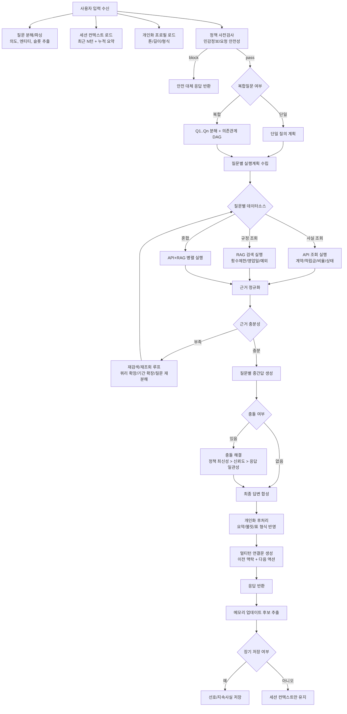

# 멀티턴 대화 응답 세부 흐름 문서 (CSV 반영)

작성일: 2026-03-06  
기준 데이터: `./data/MULTITURN_20260306.csv`

## 1) 목적
이 문서는 멀티턴 대화에서 다음을 안정적으로 처리하기 위한 실행 흐름을 정의한다.

- 개인화: 사용자 선호 형식/톤 반영
- 멀티턴 맥락 유지: 직전 대화, 누적 요약, 진행 중 이슈 유지
- 복합질문 처리: 한 문장 내 다중 의도 분해 및 통합 응답
- 하이브리드 질의: `API 사실 조회 + RAG 규정/정책 조회` 병행

## 2) CSV 분석 기반 업데이트 포인트
`MULTITURN_20260306.csv` 질문/답변 예시를 반영해 다음 규칙을 추가했다.

1. 복합 질문 패턴
- 빈도 높은 구조: `현재 상태 조회 + 재신청/제한/적용시점 문의`
- 예: 투입비율 조회 + 재변경 가능 여부, 자동이체일 조회 + 적용 기준일

2. 응답 구조 패턴
- 1문단: 계약/상태/수치 등 "현재값"
- 2문단: 가능 여부, 횟수 제한, 영업일 기준, 예외 조건

3. 데이터 소스 분리
- API: 계약 상태, 적립금, 투입비율, 자동이체일, 계좌 정보 등 실시간/개별 사실
- RAG: 신청 횟수, 영업일 기준, 가능/불가 정책, 예외 규정

4. 보안/정책 처리
- 계좌번호/민감값은 마스킹
- 정책 충돌 시 최신 규정(지식베이스 버전/공지일) 우선

## 3) 엔티티/슬롯 표준
복합질문 분해 시 아래 슬롯을 우선 추출한다.

- `product_name`: 상품명
- `contract_status`: 정상/실효 등
- `fund_ratio`: 투입비율
- `accumulated_amount`: 적립금
- `last_change_date`: 최근 변경일
- `request_date`: 신청일/변경일
- `effective_date_rule`: 신청일+n영업일, 당월/익월 반영
- `autopay_date`: 자동이체일
- `account_masked`: 계좌 마스킹 값

## 4) 멀티턴 응답 상세 흐름 (CSV 반영)

## 5) 질문 분해 규칙 (CSV형)

1. 접속사 기반 분해
- `...해줘, ...가능한가요?`
- `...확인해주고, ...알려줘`
- `...언제이며 ...몇번까지?`

2. 분해 우선순위
- `조회성 사실` 먼저(API)
- `규정/가능여부` 다음(RAG)
- `적용시점`/`예외` 마지막(RAG 또는 규정 API)

3. 의존관계 예시
- Q1: 현재 투입비율 조회(API)
- Q2: 재신청 가능 여부(RAG)
- Q3: 가능 시 적용일(영업일 규칙, RAG)

## 6) 답변 템플릿 규칙 (CSV형)

1. 기본 템플릿
- 1줄: 현재 상태/수치 (API 근거)
- 2줄: 가능 여부/횟수 제한 (RAG 근거)
- 3줄(선택): 적용 기준일/예외

2. 예시 포맷
- `[{상품명}] 계약의 투입비율은 ... 입니다.`
- `재신청은 하루 1회 가능합니다.`
- `신청일+3영업일 종가로 반영됩니다.`

3. 정책 포맷
- 계좌번호 등 민감값은 마스킹하여 출력
- 단정 불가 시 조건부 문장으로 출력

## 7) 충돌 해결 규칙

- API 사실값 vs RAG 규정 충돌 시
1. 규정 버전/공지일이 최신인 규정 우선
2. 고객 계약 특약(상품별 예외) 존재 시 계약 예외 우선
3. 확정 불가 시 "확인 필요" 안내 + 추가 조회 액션 제시

## 8) 멀티턴 메모리 저장 규칙

- 장기 메모리 저장: 사용자 선호 형식(예: 불릿), 반복되는 관심 주제
- 세션 메모리 저장: 직전 조회 계약, 방금 안내한 제한/기준일
- 저장 제외: 계좌 원문, 주민/연락처 등 민감정보

## 9) 데모 테스트 매핑 규칙
`docs/prompt-config.yaml` + `scripts/demo-prompt-test.mjs`에서 CSV를 아래처럼 사용한다.

- `원질문` -> `user_message`, `question`, `questions[0]`
- `답변예시 (현업작성필요)` -> `answer`, `drafts`, `resolved_drafts`
- `NO.`/`구분` -> 테스트 메타(`turn_data.csv_no`, `turn_data.csv_category`)

## 10) 운영 체크리스트

- [ ] 복합질문 분해 정확도 측정(질문 단위 분리율)
- [ ] API/RAG 소스 선택 정확도 점검
- [ ] 영업일/횟수 제한 규정 최신성 검증
- [ ] 민감정보 마스킹 누락 검사
- [ ] 답변 2~3단 구조(현재값+규정+적용시점) 준수율 측정
