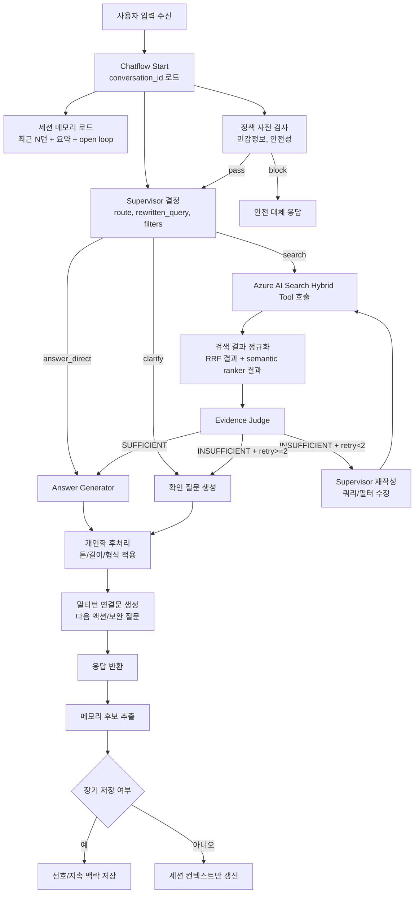

# 멀티턴 대화 응답 세부 흐름 문서 (AI Search + Dify 반영)

작성일: 2026-03-19  
기준 데이터: [../data/MULTITURN_20260306.csv](../data/MULTITURN_20260306.csv)  
참조 문서: [deep-research-report.md](deep-research-report.md)

## 1) 목적
이 문서는 `deep-research-report.md`의 `AI Search`, `Dify Workflow` 내용을 기준으로 멀티턴 상담형 Assistant의 실행 흐름을 다시 정의한다.

- 멀티턴 오케스트레이션의 중심은 `Dify Chatflow`로 둔다.
- 세션 메모리와 라우팅 판단은 `Supervisor`가 담당한다.
- 검색은 `Azure AI Search Hybrid`를 기본 검색 계층으로 사용한다.
- `Dify Workflow`는 멀티턴 메모리를 직접 들고 가지 않는 보조 실행 경로로만 사용한다.
- 검색 근거가 부족하면 `Judge -> rewrite -> search` 루프를 제한적으로 반복한다.

## 2) 반영한 핵심 원칙

1. Dify 구성 원칙
- 멀티턴 상담 흐름은 `Workflow`가 아니라 `Chatflow`를 기본 선택으로 둔다.
- `Workflow`는 메모리 없는 단발성 서브플로, 배치 처리, 후처리 자동화 용도로만 사용한다.
- 따라서 메인 대화 상태는 항상 `conversation_id` 기준으로 `Chatflow`에서 유지한다.

2. 검색 계층 원칙
- 검색은 `Azure AI Search`의 `BM25 + vector` 하이브리드 검색을 기본으로 한다.
- 검색 결과 통합은 AI Search의 기본 하이브리드 랭킹(RRF 통합)을 신뢰한다.
- 상위 후보 정렬은 가능하면 `semantic ranker`를 켠다.
- 애플리케이션 레벨에서는 별도 리랭커를 기본값으로 두지 않고, Judge가 충분성만 판정한다.

3. 멀티턴 질의 처리 원칙
- 현재 턴 질문은 최근 대화 맥락, 진행 중 이슈, 직전 답변의 미완료 슬롯을 포함해 재작성한다.
- Supervisor는 질문을 `answer_direct | search | clarify` 세 경로로 라우팅한다.
- `clarify`는 필수 슬롯이 비었거나 질문이 모호할 때만 사용한다.

4. 재검색 루프 원칙
- Judge가 `INSUFFICIENT`를 반환하면 Supervisor가 재작성한 질의로 재검색한다.
- 재검색은 기본 1회, 최대 2회까지만 수행한다.
- 2회 이후에도 부족하면 추측하지 않고 확인 필요 응답 또는 추가 질문으로 전환한다.

5. 메모리 저장 원칙
- 장기 저장 대상은 사용자 선호, 반복 관심사, 진행 중 업무 맥락만 포함한다.
- 검색 결과 원문, 민감정보, 일회성 사실값은 기본적으로 장기 메모리에 저장하지 않는다.

## 3) 구성 요소

- `Dify Chatflow`
  - 역할: 메인 대화 진입점, 세션 메모리 유지, Supervisor/Answer 생성
- `Supervisor LLM`
  - 역할: 맥락 반영 질의 재작성, 질문 분해, 툴 호출 여부 결정
- `Azure AI Search Hybrid Tool`
  - 역할: `search + vector + filter + semantic ranker` 호출
- `Evidence Judge LLM`
  - 역할: 현재 검색 근거가 답변에 충분한지 판정
- `Answer Generator LLM`
  - 역할: 근거 기반 최종 답변 생성
- `Workflow Subflow`
  - 역할: 외부 API 조회, 후처리, 비동기 작업, 배치성 작업
- `Memory Writer`
  - 역할: 저장 후보 선별 후 세션/장기 메모리 반영

## 4) 멀티턴 응답 상세 흐름


```mermaid
flowchart TD
    A[사용자 입력 수신] --> B[Chatflow Start<br/>conversation_id 로드]
    B --> C[세션 메모리 로드<br/>최근 N턴 + 요약 + open loop]
    B --> D[정책 사전 검사<br/>민감정보, 안전성]
    B --> E[Supervisor 결정<br/>route, rewritten_query, filters]

    D -->|block| DX[안전 대체 응답]
    D -->|pass| E

    E -->|answer_direct| J[Answer Generator]
    E -->|clarify| K[확인 질문 생성]
    E -->|search| F[Azure AI Search Hybrid Tool 호출]

    F --> G[검색 결과 정규화<br/>RRF 결과 + semantic ranker 결과]
    G --> H[Evidence Judge]

    H -->|SUFFICIENT| J
    H -->|INSUFFICIENT + retry<2| I[Supervisor 재작성<br/>쿼리/필터 수정]
    I --> F
    H -->|INSUFFICIENT + retry>=2| K

    J --> L[개인화 후처리<br/>톤/길이/형식 적용]
    K --> L
    L --> M[멀티턴 연결문 생성<br/>다음 액션/보완 질문]
    M --> N[응답 반환]

    N --> O[메모리 후보 추출]
    O --> P{장기 저장 여부}
    P -->|예| Q[선호/지속 맥락 저장]
    P -->|아니오| R[세션 컨텍스트만 갱신]
```

## 5) 단계별 실행 로직

### 5.1 입력 및 메모리 로드
- 입력 필수값: `message`, `conversation_id`, `user_id`
- 세션 메모리에서 다음 정보를 불러온다.
  - 최근 대화 턴
  - 누적 요약
  - 진행 중인 미해결 질문
  - 직전 턴에서 확정된 상품/계약/채널 문맥

### 5.2 Supervisor 라우팅
Supervisor는 아래 JSON 스키마를 산출한다.

```json
{
  "route": "search",
  "rewritten_query": "변액보험 투입비율 변경 가능 횟수와 적용일",
  "sub_questions": [
    "현재 투입비율 변경 가능 여부",
    "변경 신청 시 적용 기준일"
  ],
  "filters": {
    "product": "변액보험",
    "channel": "customer_center",
    "user_tier": "default"
  },
  "clarifying_question": null
}
```

판정 규칙:
- `answer_direct`: 세션 메모리와 직전 근거만으로 충분히 답할 수 있을 때
- `search`: 정책/상품 규정/근거 확인이 필요할 때
- `clarify`: 필수 엔티티가 비었거나 질문이 모호할 때

### 5.3 Azure AI Search 호출 규칙
- 기본 모드는 `hybrid`
- 가능한 경우 `semantic_ranker = true`
- 필터는 상품/채널/권한/고객 구분 등 메타데이터로 전달
- `top_k`는 기본 8~10
- 검색 결과 필드는 최소 아래를 포함한다.
  - `doc_id`
  - `title`
  - `content`
  - `score`
  - `reranker_score`
  - `metadata`

### 5.4 Judge 루프
Judge는 아래 형태로 결과를 반환한다.

```json
{
  "verdict": "INSUFFICIENT",
  "missing": "적용 기준일 규정이 없음",
  "suggested_rewrite": "변액보험 투입비율 변경 신청 후 적용일 영업일 기준"
}
```

Judge 규칙:
- 현재 질문에 필요한 핵심 조건, 제한, 예외가 모두 있으면 `SUFFICIENT`
- 일부 근거만 있고 정책 판단에 필요한 조항이 빠지면 `INSUFFICIENT`
- 부족 시 누락 정보와 재작성 방향을 명시

### 5.5 Workflow 사용 경계
- 메인 멀티턴 상태 제어는 Workflow로 옮기지 않는다.
- Workflow는 다음 유형에서만 호출한다.
  - 계약/계좌/상태 조회 API 호출
  - 결과 포맷 변환
  - 비동기 후속 처리
  - 배치/예약 작업
- Workflow 결과는 Chatflow로 되돌려 최종 판단과 답변은 Supervisor/Answer Generator가 마무리한다.

### 5.6 응답 합성 규칙
- 1문단: 현재 질문에 대한 직접 답변
- 2문단: 근거가 되는 규정/조건/예외
- 필요 시 3문단: 다음 액션 또는 추가 확인 질문
- 메모리 기반 개인화는 문체/길이/형식에만 적용하고, 근거 내용은 바꾸지 않는다.

## 6) 기존 CSV 기반 로직과의 결합

1. 복합 질의
- 기존 `Q1..Qn 분해` 규칙은 유지한다.
- 단, 각 하위 질문은 개별 검색보다 먼저 `Supervisor`에서 하나의 검색 질의로 통합 가능한지 판단한다.

2. 사실성 데이터 + 정책성 지식
- 실시간 계약 상태 조회는 `Workflow/API` 호출
- 정책/규정/횟수/적용일은 `Azure AI Search Hybrid` 검색
- 혼합형 질문이면 `Workflow/API + AI Search`를 병렬 실행한 뒤 Judge가 합쳐서 판정한다.

3. 충돌 해결
- 사실값 충돌: 최신 API 결과 우선
- 정책 충돌: 최신 공지일/규정 버전 우선
- 확정 불가: 추가 확인 필요로 응답

## 7) 메모리 저장 규칙

- 장기 메모리 저장
  - 선호 답변 형식
  - 선호 톤
  - 반복 관심 상품/업무 주제
- 세션 메모리 저장
  - 직전 조회 대상
  - 방금 설명한 규정 포인트
  - 다음 턴에서 이어질 open loop
- 저장 제외
  - 검색 원문 chunk
  - 계좌 원문/식별자
  - 일회성 상세 수치

## 8) 운영 체크리스트

- [ ] 멀티턴 메인 앱이 `Dify Chatflow` 기준으로 설계되었는가
- [ ] `Workflow`가 메모리 없는 서브플로 역할로만 제한되었는가
- [ ] 검색이 `Azure AI Search hybrid + semantic ranker` 기준으로 정의되었는가
- [ ] Judge 재검색 루프 최대 횟수가 정의되었는가
- [ ] `answer_direct | search | clarify` 라우팅이 명시되었는가
- [ ] 세션 메모리와 장기 메모리 저장 경계가 분리되었는가
