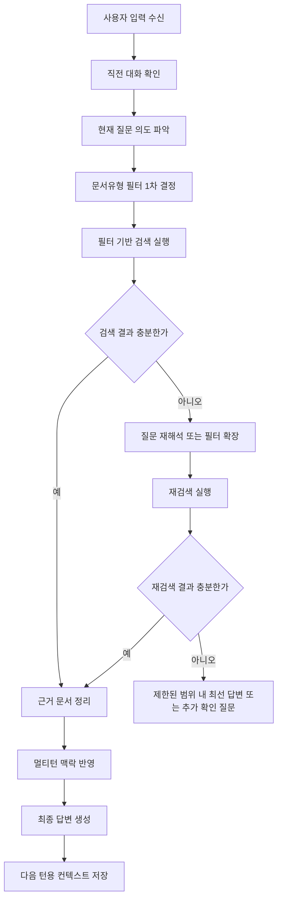

# 멀티턴 대화 기본 흐름 문서

작성일: 2026-03-09
대상 문서유형(필터): `업무매뉴얼`, `PC매뉴얼`, `상품매뉴얼`, `사업방법서`, `상담스크립트`, `약관`

## 1) 목적
이 문서는 기본적인 멀티턴 대화에서 6개 문서유형 필터를 활용하여 검색 정확도를 높이고, 검색 결과를 바탕으로 최종 답변까지 자연스럽게 연결하기 위한 최소 실행 흐름을 정의한다.

핵심 목표는 다음과 같다.

- 사용자 질문에서 문서유형 필터를 빠르게 결정한다.
- 필터 기반 검색으로 불필요한 문서 혼입을 줄인다.
- 검색 결과가 부족하면 필터를 유지하거나 확장하는 재검색 기준을 명확히 한다.
- 최종 답변에서 "무엇을 근거로 답했는지"가 드러나도록 구성한다.

## 2) 문서유형 필터 정의

| 문서유형 | 주 사용 목적 | 대표 질문 예시 |
|---|---|---|
| 업무매뉴얼 | 내부 업무 처리 절차, 운영 기준, 예외 처리 | "이 업무는 어떤 순서로 처리해?", "오류 나면 어떻게 조치해?" |
| PC매뉴얼 | 시스템 화면, 메뉴 경로, 입력 항목, 조작 방법 | "어느 메뉴에서 조회해?", "버튼은 어디서 눌러?" |
| 상품매뉴얼 | 상품 구조, 특징, 가입/변경/해지 관련 설명 | "이 상품은 어떤 특징이 있어?", "변경 가능한가?" |
| 사업방법서 | 제도/업무 원칙, 처리 기준, 업무 적용 규정 | "업무상 가능 기준이 뭐야?", "어떤 조건에서 허용돼?" |
| 상담스크립트 | 고객 응대 표현, 안내 순서, 멘트 예시 | "고객에게 어떻게 설명해?", "응대 멘트 알려줘" |
| 약관 | 계약 조건, 권리/의무, 보장/면책, 법적 기준 | "약관상 가능한가?", "해지 환급 조건이 뭐야?" |

## 3) 기본 원칙

1. 첫 검색은 가능한 한 1개 필터로 시작한다.
2. 질문이 복합적이면 질문 단위로 필터를 다르게 적용한다.
3. 절차 질문은 `업무매뉴얼` 또는 `PC매뉴얼`을 우선한다.
4. 상품 설명 질문은 `상품매뉴얼`을 우선한다.
5. 가능/불가, 기준, 예외, 적용 조건 질문은 `사업방법서` 또는 `약관`을 우선한다.
6. 고객 응대 문장 요청은 `상담스크립트`를 우선한다.
7. 근거가 약하면 무조건 전 필터 확장하지 말고, 인접 필터부터 넓힌다.

## 4) 멀티턴 기본 흐름



## 5) 단계별 상세 흐름

### 5.1 사용자 입력 수신
- 현재 질문과 최근 1~3턴을 함께 본다.
- 사용자가 이미 특정 상품, 업무, 화면, 조항을 언급했으면 우선 컨텍스트로 유지한다.
- 현재 턴에서 새로 바뀐 조건이 있으면 이전 맥락보다 현재 입력을 우선한다.

### 5.2 질문 의도 파악
질문을 아래 유형 중 하나 또는 복수로 분류한다.

- 절차 확인
- 시스템 조작
- 상품 설명
- 기준/가능 여부
- 고객 응대 문안 요청
- 약관/조항 확인

복합 질문 예시:

- "이 상품 해지 가능해? 고객한테는 어떻게 안내해?"
- 분해 결과:
  - Q1: 해지 가능 여부 확인
  - Q2: 고객 안내 문구 생성

### 5.3 문서유형 필터 1차 결정
아래 기준으로 첫 필터를 선택한다.

| 질문 신호 | 우선 필터 |
|---|---|
| 처리 절차, 접수, 승인, 변경 순서 | 업무매뉴얼 |
| 메뉴, 버튼, 화면, 입력값, 경로 | PC매뉴얼 |
| 상품 특징, 가입 조건, 변경/해지 가능 여부 | 상품매뉴얼 |
| 업무 기준, 허용 조건, 예외 규정 | 사업방법서 |
| 고객 응대, 멘트, 설명 방식 | 상담스크립트 |
| 조항, 약정, 면책, 권리/의무 | 약관 |

보조 규칙:

- `가능 여부`가 상품 설명 수준이면 `상품매뉴얼` 우선
- `가능 여부`가 규정/심사/업무 기준 수준이면 `사업방법서` 우선
- `법적 조건`이나 `계약 조항`이면 `약관` 우선

### 5.4 필터 기반 검색 실행
검색 시 최소한 다음 정보를 함께 사용한다.

- 핵심 엔티티: 상품명, 업무명, 메뉴명, 행위명
- 행위 키워드: 가입, 변경, 해지, 조회, 등록, 오류, 예외
- 문서유형 필터: 6개 중 1개 또는 질문별 선택 필터

검색 쿼리 예시:

- `연금저축 해지 가능 조건 + 상품매뉴얼`
- `계약변경 접수 절차 + 업무매뉴얼`
- `보험료 자동이체 메뉴 경로 + PC매뉴얼`
- `고객 해지 만류 안내 멘트 + 상담스크립트`

### 5.5 검색 결과 평가
다음 4가지를 기준으로 결과 충분성을 판단한다.

1. 질문 핵심어와 직접 일치하는가
2. 선택한 문서유형과 실제 문서 성격이 맞는가
3. 답변 가능한 수준의 구체성이 있는가
4. 복합 질문이면 각 질문별 근거가 확보되었는가

충분한 경우:

- 상위 1~3개 문서에서 직접 답변 가능한 근거를 추출한다.

부족한 경우:

- 동의어 치환
- 상품명/업무명 보정
- 문서유형 인접 확장
- 질문 분해 재시도

### 5.6 필터 확장 순서
한 번에 전체 문서유형으로 넓히지 말고, 아래 순서로 확장한다.

| 1차 필터 | 2차 확장 | 3차 확장 |
|---|---|---|
| 업무매뉴얼 | 사업방법서 | PC매뉴얼 |
| PC매뉴얼 | 업무매뉴얼 | 사업방법서 |
| 상품매뉴얼 | 약관 | 사업방법서 |
| 사업방법서 | 업무매뉴얼 | 약관 |
| 상담스크립트 | 상품매뉴얼 | 업무매뉴얼 |
| 약관 | 상품매뉴얼 | 사업방법서 |

확장 예시:

- 상품의 해지 가능 여부가 안 잡히면 `상품매뉴얼 -> 약관 -> 사업방법서`
- 화면 경로가 안 잡히면 `PC매뉴얼 -> 업무매뉴얼`

### 5.7 멀티턴 맥락 반영
이전 턴 정보를 다음처럼 유지한다.

- 직전 상품명
- 직전 업무 주제
- 직전 선택 문서유형
- 아직 해결되지 않은 후속 질문

예시:

- 1턴: "연금저축 해지 가능해?"
- 2턴: "그럼 고객한테는 어떻게 설명해?"
- 처리:
  - 2턴의 "그럼"은 1턴의 `연금저축 해지` 맥락을 계승
  - 검색 필터는 `상담스크립트` 우선
  - 필요하면 1턴의 `상품매뉴얼/약관` 근거를 함께 참조

### 5.8 최종 답변 생성
최종 답변은 아래 순서를 기본으로 한다.

1. 질문에 대한 직접 답변
2. 핵심 근거 요약
3. 필요한 경우 예외/유의사항
4. 멀티턴 연결 문장 또는 다음 행동 제안

기본 답변 템플릿:

```text
우선 답변:
해당 내용은 [문서유형] 기준으로 [가능/불가/절차/설명]로 확인됩니다.

근거:
[문서명 또는 문서유형]에서 [핵심 기준/절차/조건]이 확인됩니다.

추가 안내:
[예외사항/후속조치/고객 안내 포인트]
```

## 6) 복합 질문 처리 규칙

### 6.1 질문별 필터 분리
하나의 문장에 서로 다른 목적이 섞이면 질문별로 나눈다.

예시:

- "해지 가능 여부와 고객 안내 멘트 알려줘"
- 분리:
  - 해지 가능 여부: `상품매뉴얼` 또는 `약관`
  - 고객 안내 멘트: `상담스크립트`

### 6.2 답변 합성 규칙
- 사실/기준 답변을 먼저 제시한다.
- 상담 멘트나 안내 문안은 그 다음에 제시한다.
- 서로 충돌하면 기준 문서(`약관`, `사업방법서`)를 우선한다.

## 7) 답변 스타일 기준

- 내부 업무자 대상이면 핵심만 짧게 답한다.
- 절차 질문이면 순서형으로 정리한다.
- 고객 안내 요청이면 실제 말투로 변환해 준다.
- 약관/기준 질문이면 단정 표현보다 조건 표현을 우선한다.

예시:

- 절차형: "1. 접수 확인 2. 대상 계약 조회 3. 변경 가능 여부 판단"
- 안내형: "고객님, 해당 상품은 현재 조건에 따라 해지 가능 여부를 먼저 확인해야 합니다."
- 조건형: "약관상 일정 조건을 충족하는 경우 가능할 수 있습니다."

## 8) 예시 시나리오

### 시나리오 1: 단일 질문
사용자 질문:

`보험료 자동이체일 어디서 확인해?`

처리 흐름:

1. 의도 파악: 시스템 조작
2. 1차 필터 선택: `PC매뉴얼`
3. 검색: 자동이체일 + 조회 메뉴 + PC매뉴얼
4. 답변: 메뉴 경로와 확인 화면 안내

### 시나리오 2: 멀티턴 질문
1턴:

`이 상품 중도해지 가능해?`

2턴:

`그걸 고객에게 어떻게 설명하지?`

처리 흐름:

1. 1턴 필터: `상품매뉴얼` 우선, 필요 시 `약관`
2. 2턴 필터: `상담스크립트`
3. 2턴 답변 시 1턴의 해지 가능 조건을 반영
4. 최종 답변은 "기준 + 고객 안내 문구" 순으로 구성

## 9) 운영 체크리스트

- [ ] 질문별로 문서유형 필터가 명확히 선택되었는가
- [ ] 첫 검색에서 과도하게 다중 필터를 사용하지 않았는가
- [ ] 검색 부족 시 인접 필터 순서대로 확장했는가
- [ ] 멀티턴에서 이전 상품/업무 맥락을 유지했는가
- [ ] 최종 답변에 근거 문서유형이 드러나는가
- [ ] 복합 질문에서 질문별 답변이 섞이지 않았는가

## 10) 권장 결론
기본 멀티턴 흐름에서는 먼저 질문 의도에 맞는 문서유형 필터 1개를 정하고, 그 필터 안에서 검색한 뒤, 부족할 때만 인접 필터로 확장하는 방식이 가장 안정적이다. 최종 답변은 단순 검색 결과 나열이 아니라, 선택한 문서유형의 근거를 바탕으로 현재 질문에 직접 답하고 다음 턴으로 자연스럽게 이어지도록 구성한다.
